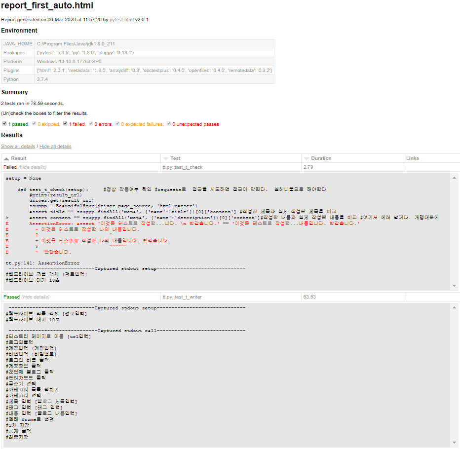

# 티스토리 블로그 작성 자동화 Pytest추가

2차 스터디 주제 Pytest 진행입니다.

## 목적

Pytest를 적용하여 테스트를 진행한다.

## 진행 스텝

01. 티스토리 글등록을 진행한다.
02. 글내용을 검증한다.
03. 리포트를 뽑는다.
04. 리포트를 확인한다.

## 파일 구성

Tistory_Auto_Pytest.py

: Pytest 모듈을 사용한다.

## 사전 준비 사항(파일 다운로드 및 모듈 설치

### 웹드라이버 다운르도
: pip install pytest
: pip install pytest-html

## 사용법

Tistory_Auto_Pytest.py파일 실행시 아래와 같이 진행한다.

    : c:/> pytest Tistory_Auto_Pytest.py --html=report.html

